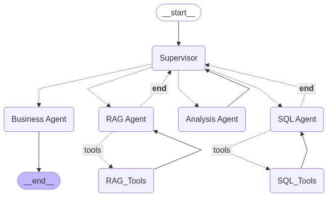

# C360 - Customer 360 Intelligence Platform

A comprehensive customer intelligence platform that combines SQL database querying with RAG (Retrieval-Augmented Generation) capabilities for enhanced customer insights.


## Architecture



- **Agents**: Modular agent system with specialized capabilities
- **Utils**: Shared utilities for database connections, vector stores, and configurations
- **Data**: Customer data including accounts, opportunities, activities, and products

## Setup

1. Install dependencies:
```bash
pip install -r requirements.txt
```

2. Configure environment variables in `.env` file

3. Install ollama locally and microsoft sql server

3. Run the application:
```bash
python app.py
```

## Data Sources

- SQL Server database with customer tables (Account, Opportunity, Product, Activity)


## Technologies Used

- LangChain and Langgraph for agent creation and orchestration
- ChromaDB for vector storage
- SQL Server for storing structured data

## Future Scope
- Adding guardrails for PII and optimizing simple response time.
- Supervisor with a simple classification model
- Setup persistent caching mechanism
- Setup fallback for sql
- Enabling artifacts mode if required